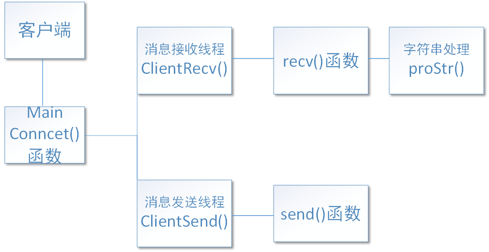

<center><h1>实验一报告 </h1></center>

**2013605-张文迪**

# 协议设计

其消息类型为**Message**，主要有四部分组成：发送人的姓名；接收人的姓名，发送时间；信息内容。

## 语法


* 如上图所示，消息主要由四部分构成：**发送人的姓名(name)**；**接收人的姓名(acceptName)**，**发送时间(sendTime)**；**消息内容(information)**。
* 数据长度都是可变的，但规定了最大字符数。其中姓名最多占用10个Byte，发送时间最多占用30个Byte，信息内容最多占用500个Byte。
* 由于数据长度可变，所以采用**特殊分隔符法**分割数据，方便消息在服务器和用户端的解析。

## 语义

* 发送人的姓名用于告诉接收人消息的来源
* 接收人的姓名是一种控制信息，用来告诉服务器消息转发的对象。当接受人指定为一个人姓名时，消息会被精准转发出去，**特别的，当接收人被指定为`ALL`时该消息会被转发给所有人**。
* 发送时间用于时间标签和日志的记录等。
* 消息内容是用户想要真正传递给别人的信息。
* 管道符“|”用于表示消息各组成部分界限

## 时序

1. 客户端连接到服务器后向服务器发送其用户名。
2. 服务器将用户的姓名存储到用户数据结构(myClient)中，并建立姓名到id(数组索引)的map映射
3. 客户端按照协议的语法和语义规则发送报文到服务器
4. 服务器对应的按照协议的语法和语义规则解析出接收人的用户名，并根据map映射找到socket
5. 根据socket将消息转发给目标客户端
6. 接受方按照协议的语法和语义规则解析出报文并打印

# 传输流程及各模块功能

## 连接建立、多线程通信及录用户管理

### 服务器端

**当服务器与一个客户端建立连接，都新建一个线程进行信息的传递**

```c++
SOCKET serverSocket = socket(AF_INET, SOCK_STREAM, IPPROTO_TCP);//创建welcome socket
SOCKADDR_IN serverAddr;
serverAddr.sin_family = AF_INET;      //IP格式
USHORT uPort = 8888;				  //固定端口号
serverAddr.sin_port = htons(uPort);   //绑定端口号
serverAddr.sin_addr.S_un.S_addr = inet_addr("127.0.0.1");//固定IP
bind(serverSocket, (SOCKADDR*)&serverAddr, sizeof(serverAddr))//将socket与IP与端口绑定
listen(serverSocket, maxClient);//开始监听，等待客户端连接
accept(serverSocket,(SOCKADDR*)&clientAddr,sizeof(SOCKARR_IN));//返回用于通信的socket
//线程的建立，服务器与每一个客户端都建立一个线程
hThread = CreateThread(NULL, NULL, clien_run, (LPVOID)&clients[num], 0, NULL);
```

**服务器端在于客户端建立连接后，需要维护一个用户数据结构，方便管理和数据的转发**

* **根据建立连接的时间顺序，确定用户id号，同时也是用户数据结构(myClient)在数组的索引**
* **将用户的姓名与id号建立一个map映射，方便服务器快速查找用户，不必遍历用户数组查找**
* **用户上线时，valid初始化为1，当用户下线时，valid设置为0，代表不会再收到消息**
* **socket即连接建立后返回的socket**

```c++
//用户数据结构
class myClient
{
    public:
    int id;//用户id号
    int valid;//用户是否在线的标志位
    char *name;//用户姓名
    SOCKET scoket;//连接建立后返回的通信socket
    myClient();
};
myClient clients[maxClient];//将用户数据结构存储在数组中
map<string,int> name_id;//姓名与id(数组索引)映射
```

### 客户端

**与服务器建立连接会创建两个线程，一个用于发送消息，另外一个接收消息。**

```c++
SOCKET clientSocket = socket(AF_INET, SOCK_STREAM, IPPROTO_TCP);//客户端client的建立
//指定服务器的地址
SOCKADDR_IN serverAddr;
serverAddr.sin_family = AF_INET;      //IP格式
USHORT uPort = 8888;
serverAddr.sin_port = htons(uPort);   //绑定端口号
serverAddr.sin_addr.S_un.S_addr = inet_addr("127.0.0.1");
//与服务器建立连接
connect(clientSocket, (SOCKADDR *) &serverAddr, sizeof(SOCKADDR))
//当与服务器建立连接时，新建两个线程用于消息的发送与接收   
HANDLE hthread[2];
hthread[0] = CreateThread(NULL, 0, clientRecv, (LPVOID) &clientSocket, 0, NULL);
hthread[1] = CreateThread(NULL, 0, clientSend, (LPVOID) &clientSocket, 0, NULL);
```

## 传输流程


* **当客户端与服务器建立连接后，客户端会创建两个线程，一个用于发送消息，另外一个接收消息。在发送消息的线程中，会先要求用户发送自己的姓名给服务器。之后用户可以随意地发送消息。**
* **每当与一个客户端相连，服务器就会创建一个线程，用于接受与转发来自此客户端的消息。服务器会把来自客户端的第一条消息解析成用户姓名存储在“用户”数据结构(myClient)中。当再接收到后来的消息时，会根据Message的格式解析出接收者的姓名，根据map映射寻找到对应的socket，然后进行转发。**
* **客户端接收消息的线程接收到来自服务器的Message后，会根据Message的格式解析出发送者姓名，然后打印出来。**

## 客户端发送消息的实现

* 当客户端与服务器建立连接后，会先提示用户输入姓名，然后客户端会将姓名发送给服务器。
* 然后提示用户输入消息的格式“接收人姓名    消息内容”，客户端会把输入按照协议规则打包成报文发送给服务器

```c++
DWORD WINAPI clientSend(LPVOID lparam) {	//客户端用于发送消息的线程
    SOCKET *socket = (SOCKET *) lparam;
    char *name = new char[nameSize];
    memset(name, 0, nameSize);
    cin>>name;	//发送者的姓名
    int len = send(*socket, name, strlen(name), 0);	//向服务器发送自己的姓名即告知身份。
    char sendData[1024];	//用于存储报文
    //下面三个字符数组分别存储接收者姓名，发送时间，消息内容
    char acceptName[nameSize];	char sendTime[30];	char info[500];
    while (true) { 
        //获取当前时间
        time_t timep;
        time (&timep);
        strftime(sendTime, sizeof(sendTime), "%Y-%m-%d %H:%M:%S",localtime(&timep) );
        cin>>acceptName;
        if(strcmp("quit",acceptName)==0){	//判断用户是否退出
 			strcpy(sendData,name);strcat(sendData,"|");strcat(sendData,"ALL");
            strcat(sendData,"|");strcat(sendData,sendTime);strcat(sendData,"|");
            strcat(sendData,"quit");	//报文的组合，以管道符“|”为分隔符
            cout<<sendTime<<"   您已成功退出聊天"<<endl;
            int len = send(*socket,sendData,strlen(sendData),0);
            return 0;
        }
        //如果用户不是退出，则用户可输入具体消息内容
        cin.getline(info,500);  
        //同上组合报文并发送。省略......
        memset(sendData, 0, 1024);
    }
}
```

## 服务器端接受消息的实现

* 服务器会把来自客户端的第一条信息解析成用户姓名，然后存储在用户数据结构中(myClient)，并建立map映射
* 然后循环接收后面来自客户端的报文

```c++
DWORD WINAPI clien_run(LPVOID lparam) {
    myClient * client = (myClient*) lparam;
    //接收客户端的name并将与id的映射存储在map数据结构中
    char name[nameSize];
    memset(name,0,nameSize);
    int len = recv(client->scoket, name, nameSize-1, 0); //接收用户名
    if(len==0){
         cout<<"连接已经关闭"<<endl;
    }
    //完善用户数据结构与map的映射
    name[len] = '\0';	client->name = name; name_id[name]=client->id;
    cout<<onlineTime<<"    "<<client->name<<"上线"<<endl;	//日志打印
    char recvData[1024];	char sendData[1024];	//接收消息与转发的临时存储空间
    while(true)
    {
        int len = recv(client->scoket, recvData, 1023, 0);	//接收消息（会阻塞）
        recvData[len]='\0';
        if(len>0){
            proStr(recvData);//对接受的消息根据报文格式解析，然后实现转发、群发等功能；
        }
        memset(recvData,0,1024);
    }
}
```

## 服务器转发消息的实现

这是聊天程序最核心的部分之一，它负责将收到的报文按照协议的语法和语义规则进行解析然后发送给指定的用户或群发。

* 当消息内容(info)为quit时，将用户数据结构 (myClient)的valid位置零，代表用户下线；
* 当接受人指定为"ALL"时，会遍历用户用组，并将消息发送给valid位为1的用户；
* 当接收人为其他值时，会先根据map映射找到用户数据结构在数组索引，然后寻找到对应socket,进行转发
* 全程打印日志

```c++
void proStr(char *recvData){	//recvData即接收到的信息
    string sendName,acceptName,sendTime,info,pattern = "|";	//字符串间隔用"|"表示
    string str = recvData;	string strs = str + pattern;	//结尾加上"|"，方便循环解析
    size_t pos = strs.find(pattern);						//寻找到第一个分隔符
    int i=0;
    while(pos != strs.npos){
        string temp = strs.substr(0, pos);	//分隔符前报文的一个组成部分
        //去掉已分割的字符串,在剩下的字符串中进行分割
        strs = strs.substr(pos+1, strs.size());
        pos = strs.find(pattern);			//寻找下一个分隔符
        switch (i){
        case 0:
            sendName = temp;
            break;
        case 1:
            acceptName = temp;
            break;
        case 2:
            sendTime = temp;
        case 3:
            info   = temp;
        default:
            break;
        }
        i++;
    }
    //日志的输出
    cout<<sendName<<" 在 "<<sendTime<<" 向 "<<acceptName<<" 发送了一条消息"<<endl;
    if(info=="quit"){	//退出聊天的实现
        cout<<sendTime<<"   "<<sendName<<"退出聊天"<<endl;
        clients[name_id[sendName]].valid=0;
    }
    if(acceptName=="ALL"){	//实现群发功能
        for (auto iter = name_id.begin(); iter != name_id.end(); ++iter) {//群发
			if (iter->second == name_id[sendName]||
                clients[iter->second].valid==0)continue;
			send(clients[iter->second].scoket, recvData, strlen(recvData), 0);
		}
    }
    else{
        map<string,int>::iterator iter = name_id.find(acceptName);
        if(iter != name_id.end()&&clients[iter->second].valid==1) 
            send(clients[iter->second].scoket,recvData,strlen(recvData),0);
        else    //当找不到用户时，打印日志
        cout<<sendTime<<"   "<<"找不到用户"<<endl;
    }
}
```

## 客户端接受消息的实现

**与服务器端接受消息类似，直接格式化打印即可，不再赘述。**


## 模块调用关系图

### 客户端

 

### 服务器


# 程序界面展示及运行说明

## 连接及上线

* 首先上线三个用户，输入姓名后，便可以指定收信人并发送消息
* 服务器会打印相应的日志信息


## 私聊

* 如下图所示，张文迪分别向Bob和Alice发送了私聊信息
* Bob和Alice也都能根据发信人做出相应的回应
* 服务器打印相应日志


## 群聊

* 如下图所示，当使用群聊时，所有人都能收到消息
* 服务打印相应日志


#  实验过程中遇到的问题及分析

问题描述：当直接结束掉客户端的进程后，服务器会一直打印无意义的日志

原因：当客户端与服务器断开连接时，`recv`函数不再阻塞。因为while循环，所以在服务器端会一直打印无意义的日志。

解决办法：

添加一个判断语句，当接收到的消息长度大于零时，才进入下一阶段。

```c++
int len = recv(client->scoket, recvData, 1023, 0);
recvData[len]='\0';
if(len>0){
	proStr(recvData);//实现消息分析、转发、群发等功能；
}
```

----------

问题描述：用户上线后，服务器不打印日志，并且出现无响应情况

原因：localtime函数在多线程下是不安全的，并且可能会出现死锁问题

解决办法：

在多线程下不使用localtime函数，而是使用一个线程不断更新全局变量sendTime的值，在多线程下直接访问全局变量的值从而得到时间。

```c++
//获取时间
char onlineTime[20];
DWORD WINAPI updateTime(LPVOID lparam) {
    while(true){
        Sleep(500);
        time_t timep;
        time (&timep);
        strftime(onlineTime, sizeof(onlineTime), 
        "%Y-%m-%d %H:%M:%S",localtime(&timep) );
    }
    return 0;
}
```


