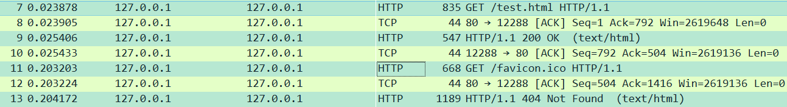
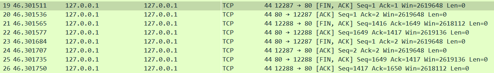

<center><h1>实验二报告</h1></center>

> 2013605	张文迪

# 实验要求

1. 搭建Web服务器（自由选择系统），并制作简单的Web页面，包含简单文本信息（至少包含专业、学号、姓名）和自己的LOGO。
2. 通过浏览器获取自己编写的Web页面，使用Wireshark捕获浏览器与Web服务器的交互过程，并进行简单的分析说明。
3. 提交实验报告。

# Web服务器搭建与Web页面制作

## Web服务器搭建

* 使用maven构建JavaWeb项目，在`pom.xml`文件中添加对应的依赖

* 使用嵌入式的tomcat插件来运行Web服务，需要设置版本和端口号等

  ```xml
  <plugins>
  	<!-- tomcat插件控制 -->
      <plugin>
          <groupId>org.apache.tomcat.maven</groupId>
          <artifactId>tomcat7-maven-plugin</artifactId>
          <version>2.2</version>
          <configuration>
              <!--指定服务器的端口号为80，即默认的80端口 -->
              <port>80</port> 
              <path>/</path>
              <ignorePackaging>true</ignorePackaging>
          </configuration>
      </plugin>
  </plugins>
  ```

**其总体框架如下图所示：**


## HTML页面的设计

```html
<html>
<head>
    <title>test</title>
    <!-- 指定编码格式，防止中文乱码 -->
    <meta charset="utf-8">
</head>
<body>
<h1>专业：信息安全 </h1>
<h1>学号：2013605 </h1>
<h1>姓名：张文迪</h1>

</body>
</html>
```

# 访问

**由于指定Web服务为默认端口号80，所以可直接通过`127.0.0.1/test.html`来进行访问，不需要指定端口号**。结果如下所示：


# 捕获交互过程并分析

1. 首先使用tomcat插件开启Java Web服务，使其运行在本机的`80`端口
2. 然后开启Wireshark，由于是在本机开启的Web服务并且使用本机浏览器进行访问，所以捕获选项的输入选择`Adapter for loopback traffic capture`，即抓取本地环回的数据。
3. 由于服务器运行在`80`端口，那么我们只关心与`80`端口相关的数据包，那么可以设置过滤规则：`port 80`。然后开始开始捕获。


4. 在浏览器中中输入`127.0.0.1/test.html`可以访问到事先设计好的html页面，然后查看Wireshark捕获到的数据报文和分组


## HTTP相关数据包



**首先查看两个GET请求：**


从HTTP请求(request)报文来看，它主要由两部分组成：请求行和请求头

> 请求行
>
> 包括请求方法、请求URL、HTTP版本和回车换行字符
>
> 上图中显示请求方法为GET；URL分别为/test.html，/favicon.ico；采取的协议版本为HTTP/1.1。其中/test.html是我们在浏览器中输入的想要请求的页面，而/favicon.ico即`Favorites Icon`的缩写，是指显示在浏览器收藏夹、地址栏和标签标题前面的个性化图标，方便以图标的方式区别不同的网站。

>请求头
>
>请求头是以冒号分隔的键名与键值对，以回车(CR)加换行(LF)符号序列结尾。它们定义了一个超文本传输协议事务中的操作参数。
>
>Host是指访问的URL；`Connection:keep alive`指定为持久连接；`sec-ch-ua`是被提出用来代替User-Agent的，提供与浏览器关联的品牌和重要版本，在受支持的浏览器上默认发送，可以被用户手动禁止。标题可以包含任何位置和任何名称的“假”身份。此功能旨在防止服务器直接拒绝未知用户代理，迫使用户代理对其身份标识撒谎；`sec-ch-ua-mobile`表示是否为移动端用户；`sec-ch-ua-platform`表示操作系统名称；`Accept`浏览器能够接受的内容消息；`Sec-Fetch-Site`请求发起者的来源与目标资源来源之间的关系；`Sec-Fetch-Mode`该请求头表明了一个请求的模式；`sec-Fetch-Dest`表示请求的目的地，即如何使用获取的数据；`referrer`用于指明当前流量的来源参考页面；`Accept-Encoding`声明浏览器支持的编码类型；`Accept-Language`浏览器所支持的语言类型。
>
>`If-None-Match`允许在对应的内容未被修改的情况下返回304未修改（ 304 Not Modified ），在本次实验中，如果在html文件没有修改的前提下重复访问该页面，服务器则会响应304
>
>`If-Modified-Since`一个文件最后修改日期，允许在对应的内容未被修改的情况下返回304未修改
>
>

下面查看两个response回应


从HTTP相应行来看，它主要由三部分组成：响应行、响应头和响应体

> 响应行
>
> 其中包括HTTP版本号、状态码和解释
>
> 本次实验请求/test.html得到的状态码为200，代表请求成功；请求/favicon.ico得到的状态码为404，代表请求的资源不存在，因为我并未在服务器根目录下添加网站图标文件。

> 响应头
>
> `server`代表服务器的名字；`Content-Type`当前内容的`MIME`类型（一个拓展的电子邮件标准）；`Content-Language`内容所使用的语言；`Content-Length`回应消息的长度，以字节为单位；`Date`此条消息被发送时的日期和时间(按照 RFC 7231 中定义的“超文本传输协议日期”格式来表示)；

> 响应体
>
> 响应的数据部分

## TCP相关数据包

### TCP相关协议结构


> 序列号（seq，32位长）
>
> * 如果含有同步化旗标（SYN），则此为最初的序列号；第一个资料比特的序列码为本序列号加一。
>
> - 如果没有同步化旗标（SYN），则此为第一个资料比特的序列码。
>
> 确认号（ack，32位长）—期望收到的数据的开始序列号。也即已经收到的数据的字节长度加1。

### TCP三次握手

TCP用三次[握手](https://zh.wikipedia.org/zh-cn/握手_(技术))过程创建一个连接。在连接创建过程中，很多参数要被初始化。

服务器端执行了listen函数后，就在服务器上创建起两个队列：

- SYN队列：存放完成了二次握手的结果。 队列长度由listen函数的参数backlog指定。
- ACCEPT队列：存放完成了三次握手的结果。队列长度由listen函数的参数backlog指定。

三次握手协议的过程：

1. 客户端通过执行connect函数向服务器端发送一个SYN包，请求一个主动打开。该包携带客户端为这个连接请求而设定的随机数**A**作为消息序列号。进入SYN_SEND状态
2. 服务器端收到一个合法的SYN包后，把该包放入SYN队列中；回送一个SYN/ACK。ACK的确认码应为**A+1**，SYN/ACK包本身携带一个随机产生的序号**B**。进入[SYN_RECV](https://baike.baidu.com/item/SYN_RECV?fromModule=lemma_inlink)状态。
3. 客户端收到SYN/ACK包后，发送一个[ACK包](https://zh.wikipedia.org/wiki/確認訊息)，该包的序号被设定为**A+1**，而ACK的确认码则为**B+1**。然后客户端的connect函数成功返回。当服务器端收到这个ACK包的时候，把请求帧从SYN队列中移出，放至ACCEPT队列中；这时accept函数如果处于阻塞状态，可以被唤醒，从ACCEPT队列中取出ACK包，重新创建一个新的用于双向通信的sockfd，并返回。进入Established状态。


> 如上图所示，浏览器通常会创建多个线程与服务器建立连接，所以我们此次分析只针对与其中一个TCP连接，即port 1288
>
> 第一次握手：首先由本机的12288端口向80发送一个SYN包，包含的序列号（seq）为零、接受窗口大小（Win)为65535，后面为可选位（最大报文段长度、窗口扩大因子）
>
> 第二次握手：服务器向客户端发送一个SYN/ACK包，其确认码（ACK）为1，序列号（seq）为零，服务器端如果在一定时间内没有收到客户端的ACK包会重发SYN-ACK
>
> 第三次握手：本机向服务器发送一个ACK包，序列号（seq）为1，确认码（ACK）为1
>
> 除了首部外所有数据的长度均为零。


### TCP的四次挥手

客户端和服务器端都可以主动发起挥手。四次挥手的过程：


> 在这个过程中连接的每一侧都独立地被终止。当一个端点要停止它这一侧的连接，就向对侧发送FIN，对侧回复ACK表示确认。因此，拆掉一侧的连接过程需要一对FIN和ACK，分别由两侧端点发出。
>
> 首先发出FIN的一侧，如果给对侧的FIN响应了ACK，那么就会超时等待2*MSL时间，然后关闭连接。在这段超时等待时间内，本地的端口不能被新连接使用；避免延时的包的到达与随后的新连接相混淆。



> 由于客户端开启了多线程，我们同样只对12288端口分析
>
> 第一次挥手：客户端向服务器发送FIN，序列号为1416，确认码为1649。然后进入**FIN-WAIT-1**状态表示本方的数据发送全部结束，等待TCP连接另一端的ACK确认包或FIN&ACK请求包。
>
> 第二次挥手：服务发送一个ACK给C客户端，序列码为1649，确认码为1417，说明FIN和SYN类似占用一个序号，然后客户端进入**FIN-WAIT-2**状态其这时可以接收数据，但不再发送数据。服务器进入**CLOSE-WAIT**状态，这时可以发送数据，但不再接收数据。
>
> 第三次挥手，服务器发送一个FIN给客户端，序列码为1649，确认码为1417，进入**LAST-ACK**状态等待确认包
>
> 第四次挥手，客户端收到FIN后，发送一个ACK包，序列码为1517，确认码为1650，同时进入**TIME-WAIT**状态，等待足够时间以确保被动关闭端收到了终止请求的确认包按照RFC 793，一个连接可以在TIME-WAIT保证最大四分钟，即[最大分段寿命](https://zh.wikipedia.org/wiki/最大分段寿命)（maximum segment lifetime）的2倍）。然后server进入**CLOSED** 状态，完全没有连接。