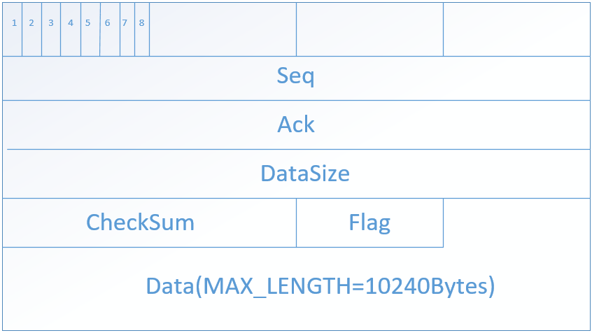
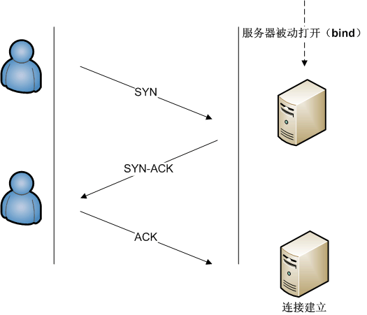
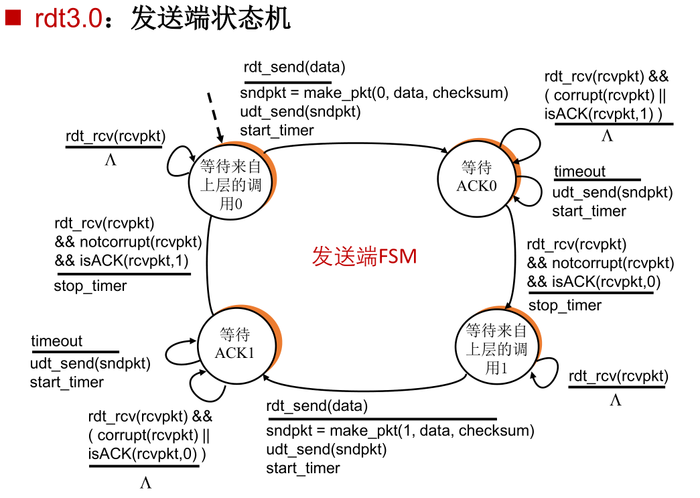
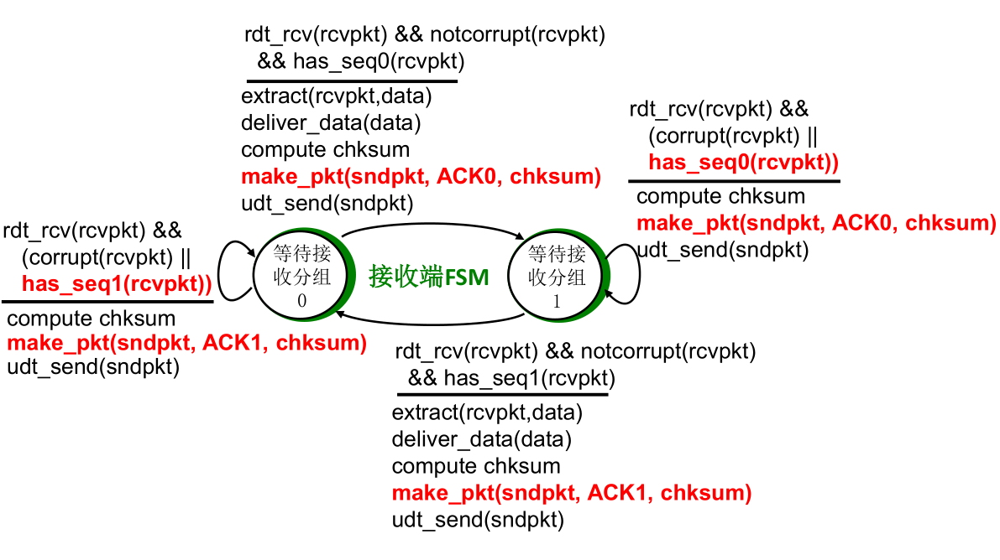
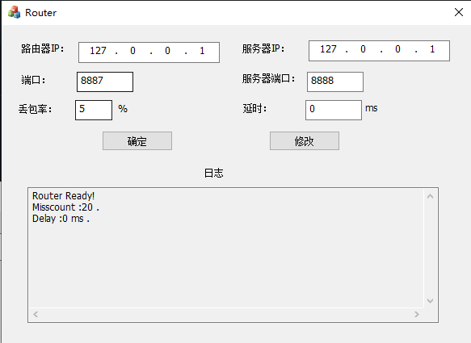
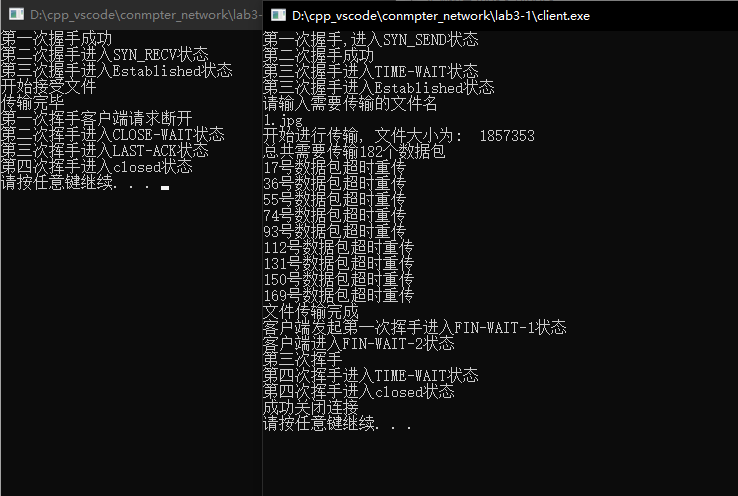

<h1><center>实验3-1报告</center></h1>

> 2013605 张文迪

# 实验要求

利用数据报套接字在用户空间实现面向连接的可靠数据传输，功能包括：建立连接、差错检测、确认重传等。流量控制采用停等机制，完成给定测试文件的传输。

# 协议设计

> 本次实验采用 RDT3.0 实现可靠数据传输

**报文结构:**



**定义：**

```c++
#define MAX_DATA_SIZE 10240
struct RDTHead
{
    unsigned int seq;//序列号，发送端
    unsigned int ack;//确认号码，发送端和接收端用来控制
    unsigned short checkSum;//校验和 16位
    unsigned int dataSize;      //标识发送的数据的长度,边界判断与校验和
    char flag;              //ACK，FIN，SYN，END
    
    RDTHead()
    {
        this->seq=this->ack=0; 
        this->checkSum=this->dataSize=this->flag=0;
    }
};

struct RDTPacket
{
    /* data */
    RDTHead head;
    char data[MAX_DATA_SIZE];
};
```


如图所示，数据报文由报文头和数据部分组成。其都为定长。

## 报文头

> Seq：在RDT3.0只有0和1两种取值。表示发送的报文的序列号，接收端识别并确认。
>
> Ack：与SEQ对应，只有0和1两种取值。表示接收端对收到的报文的序列号的确认。
>
> CheckSum：校验和，可以确认报文在传输过程中是否受到损坏，用于差错检测。
>
> Flag：用于握手和挥手过程的标识。主要用到了低四位标识不同的包。
>
> DataSize：标识数据部分实际有效大小，用来确定传输文件的边界。
>
> > SYN 0x1：用于三次握手
> >
> > ACK 0x2：用于三次握手和四次挥手
> >
> >  FIN 0x4：用于四次挥手
> >
> > END 0x8：用于标识单个文件传输完毕。

## 报文数据

**由于路由程序转包的最大包大小为 15000 字节，所以报文总的数据大小不能超过15000字节，所以设计报文的数据部分大小为10240字节。**

# 差错检测

**利用数据报中携带冗余位（校验和域段）来检测数据报传输过程中出现的差错。**

> 发送端：
>
> * 校验和域段清0，将数据报用0补齐为16位整数倍
> * 将伪首部和数据报一起看成16位整数序列
> * 进行 16 位二进制反码求和运算，计算结果取反写入校验和域段

> 接收端：
>
> * 无需清空校验位
> * 计算与发送端相同
> * 如果计算结果位全0，没有检测到错误；否则，说明数据报存在差错

```c++
//计算校验和
unsigned short CalcheckSum(unsigned short *packet, unsigned int dataSize)
{
    unsigned long sum = 0;
    int count = (dataSize + 1) / 2;

    unsigned short *temp = new unsigned short [count];
    memset(temp, 0, 2 * count);
    memcpy(temp, packet, dataSize);

    while (count--) {
        sum += *temp++;
        if (sum & 0xFFFF0000) {
            sum &= 0xFFFF;
            sum++;
        }
    }
    return ~(sum & 0xFFFF);
}
```


# 建立连接：三次握手



**类似于TCP三次握手过程：**

1. 客户端向服务器端发送一个SYN包，请求一个主动打开。进入SYN_SEND状态

2. 服务器端收到一个合法的SYN包后，回送一个SYN/ACK。进入SYN_RECV状态。
3. 客户端收到SYN/ACK包后，发送一个ACK包然后进入Established状态。当服务器端收到这个ACK包的时候。进入Established状态。


# 关闭连接：四次挥手


**类似于TCP的四次挥手：**

1. 第一次挥手：客户端向服务器发送FIN包，然后进入FIN-WAIT-1状态表示本方的数据发送全部结束，等待连接另一端的ACK确认包或FIN&ACK请求包。
2. 第二次挥手：服务发送一个ACK给客户端，然后客户端进入FIN-WAIT-2状态，这时可以接收数据，但不再发送数据。服务器进入CLOSE-WAIT状态，这时可以发送数据，但不再接收数据。
3. 第三次挥手，服务器发送一个FIN给客户端，进入LAST-ACK状态，等待确认包
4. 第四次挥手，客户端收到FIN后，发送一个ACK包，同时进入TIME-WAIT状态，等待足够时间以确保被动关闭端收到了终止请求的确认包。然后server进入CLOSED 状态，完全没有连接。

# 可靠数据传输

> 本次实验采用 RDT3.0 实现可靠数据传输

## 发送端

**发送端状态机：**



> * 发送端给定的序列号只有两个0和1，当发送出一个数据包后，便转换状态等待确认包。
> * 发送端接收到重复的ACK或者校验和出现错误，便什么也不做（不切换状态也不停止计时）若超时则重传当前的分组。
> * 接收到正确的确认包会停止计时并切换状态

```c++
void send(char *fileBuffer, size_t filelen, SOCKET &socket, SOCKADDR_IN &addr) {
    u_long imode = 1;
    ioctlsocket(socket, FIONBIO, &imode); //先进入非阻塞模式
    int packetNum = int(filelen / MAX_DATA_SIZE); int remain = filelen % MAX_DATA_SIZE ? 1 : 0;
    packetNum += remain;
    int num = 0;  //数据包的索引                      
    int stage = 0; //有限自动状态机
    int addrLen = sizeof(addr);
    char *dataBuffer = new char[MAX_DATA_SIZE], *pktBuffer = new char[sizeof(RDTPacket)];
    RDTPacket sendPkt, rcvPkt;   
    cout <<"总共需要传输"<< packetNum << "个数据包" <<endl;
    clock_t start;
    while (true) {
        int dataSize;
        if (num == packetNum) {
            RDTHead endHead;
            setEND(endHead.flag);
            endHead.checkSum = CalcheckSum((u_short *) &endHead, sizeof(RDTHead));
            memcpy(pktBuffer, &endHead, sizeof(RDTHead));
            sendto(socket, pktBuffer, sizeof(RDTHead), 0, (SOCKADDR *) &addr, addrLen);

            while (recvfrom(socket, pktBuffer, sizeof(RDTHead), 0, (SOCKADDR *) &addr, &addrLen) <= 0) {
                if (clock() - start >= MAX_TIMEOUT) {
                    memcpy(pktBuffer, &endHead, sizeof(RDTHead));
                    sendto(socket, pktBuffer, sizeof(RDTHead), 0, (SOCKADDR *) &addr, addrLen);
                    start = clock();
                }
            }
            RDTHead serverACK;
            memcpy(&serverACK,pktBuffer,sizeof(RDTHead));
            if(isACK(serverACK.flag))
                cout<<"文件传输完成"<<endl;
            return;
        }
        switch (stage) {
            case 0:
                dataSize = MAX_DATA_SIZE;
                if((num+1)*MAX_DATA_SIZE>filelen){
                    dataSize = filelen-num*MAX_DATA_SIZE;
                }
                memcpy(dataBuffer, fileBuffer + num * MAX_DATA_SIZE, dataSize);
                sendPkt = mkPacket(0, dataBuffer, dataSize);
                memcpy(pktBuffer, &sendPkt, sizeof(RDTPacket));
                sendto(socket, pktBuffer, sizeof(RDTPacket), 0, (SOCKADDR *) &addr, addrLen);
                start = clock();//计时
                stage = 1;
                break;
            case 1:
                //超时的情况
                while (recvfrom(socket, pktBuffer, sizeof(RDTPacket), 0, (SOCKADDR *) &addr, &addrLen) <= 0) {
                    if (clock() - start >= MAX_TIMEOUT) {
                        sendto(socket, pktBuffer, sizeof(RDTPacket), 0, (SOCKADDR *) &addr, addrLen);
                        cout << num << "号数据包超时重传" << endl;
                        start = clock();
                    }
                }
                memcpy(&rcvPkt, pktBuffer, sizeof(RDTPacket));
                
                //收到重复的包或者校验和错误
                if (rcvPkt.head.ack == 1 || CalcheckSum((u_short *) &rcvPkt, sizeof(RDTPacket)) != 0) {
                    stage = 1;
                    break;
                }            
                if (rcvPkt.head.ack == 0 || CalcheckSum((u_short *) &rcvPkt, sizeof(RDTPacket)) == 0) {
                    stage = 2;
                    num++;
                    break;
                }
                break;                
            case 2:
                dataSize = MAX_DATA_SIZE;
                if((num+1)*MAX_DATA_SIZE>filelen){
                    dataSize = filelen-num*MAX_DATA_SIZE;
                }
                memcpy(dataBuffer, fileBuffer + num * MAX_DATA_SIZE, dataSize);
                sendPkt = mkPacket(1, dataBuffer, dataSize);
                memcpy(pktBuffer, &sendPkt, sizeof(RDTPacket));
                sendto(socket, pktBuffer, sizeof(RDTPacket), 0, (SOCKADDR *) &addr, addrLen);
                start = clock();
                stage = 3;
                break;
            case 3:
                //超时情况
                while (recvfrom(socket, pktBuffer, sizeof(RDTPacket), 0, (SOCKADDR *) &addr, &addrLen) <= 0) {
                    if (clock() - start >= MAX_TIMEOUT) {
                        sendto(socket, pktBuffer, sizeof(RDTPacket), 0, (SOCKADDR *) &addr, addrLen);
                        cout << num << "号数据包超时重传" << endl;
                        start = clock();
                    }
                }
                memcpy(&rcvPkt, pktBuffer, sizeof(RDTPacket));
                //收到重复的包或者校验和错误
                if (rcvPkt.head.ack == 0 || CalcheckSum((u_short *) &rcvPkt, sizeof(RDTPacket)) != 0) {
                    stage = 3;
                    break;
                }
                if (rcvPkt.head.ack == 0 || CalcheckSum((u_short *) &rcvPkt, sizeof(RDTPacket)) == 0) {
                    stage = 0;
                    num++;
                    break;
                }
                break;
        }
    }
}
```

## 接收端

**接收端状态机：**



> * 当接收到带有正确序列号（当前状态等待的）的数据包时，会发送与接收到的数据包序列号相同的ACK给发送端，并切换状态
>
> * 当接收到带有错误序列号（不是状态等待的）的数据包或者校验和错误时，会发送上一个数据包序列号给发送端，并维持当前状态

```c++
bool recv(char *fileBuffer, SOCKET &socket, SOCKADDR_IN &addr, unsigned long &filelen) {
    int event = 0; //状态
    int num = 0;   //数据包个数
    int dataSize;   //数据包数据段长度
    int addrLen = sizeof(addr);
    char *pktBuffer = new char[sizeof(RDTPacket)];
    RDTPacket rcvPkt, sendPkt;
    RDTHead overHead;
    while (true) {
        memset(pktBuffer, 0, sizeof(RDTPacket));
        switch (event) {
            case 0:
                //先确认是不是发送的结束包
                recvfrom(socket, pktBuffer, sizeof(RDTPacket), 0, (SOCKADDR *) &addr, &addrLen);
                memcpy(&overHead, pktBuffer, sizeof(RDTHead));

                if (isEND(overHead.flag)) {
                    cout << "传输完毕" << endl;
                    RDTHead endPacket;
                    setACK(endPacket.flag);
                    endPacket.checkSum = CalcheckSum((u_short *) &endPacket, sizeof(RDTHead));
                    memcpy(pktBuffer, &endPacket, sizeof(RDTHead));
                    sendto(socket, pktBuffer, sizeof(RDTHead), 0, (SOCKADDR *) &addr, addrLen);
                    return true;
                }

                memcpy(&rcvPkt, pktBuffer, sizeof(RDTPacket));

                //校验位不正确或收到重复的包
                if (rcvPkt.head.seq == 1 || CalcheckSum((u_short *) &rcvPkt, sizeof(RDTPacket)) != 0) {
                    sendPkt = mkPacket(1);
                    memcpy(pktBuffer, &sendPkt, sizeof(RDTPacket));
                    sendto(socket, pktBuffer, sizeof(RDTPacket), 0, (SOCKADDR *) &addr, addrLen);
                    event = 0;
                    cout << num  << "号数据包重复或损坏, 抛弃" << endl;
                    break;
                }


                //收到正确的数据包
                if (rcvPkt.head.seq == 0 || CalcheckSum((u_short *) &rcvPkt, sizeof(RDTPacket)) == 0){
                    dataSize = rcvPkt.head.dataSize;
                    memcpy(fileBuffer + filelen, rcvPkt.data, dataSize);
                    filelen += dataSize;
                    //发送确认包
                    sendPkt = mkPacket(0);
                    memcpy(pktBuffer, &sendPkt, sizeof(RDTPacket));
                    sendto(socket, pktBuffer, sizeof(RDTPacket), 0, (SOCKADDR *) &addr, addrLen);
                    event = 1;
                    num++;
                    break;
                }    
                break;
            case 1:
                //先确认是不是发送的结束包
                recvfrom(socket, pktBuffer, sizeof(RDTPacket), 0, (SOCKADDR *) &addr, &addrLen);
                memcpy(&overHead, pktBuffer, sizeof(RDTHead));
                if (isEND(overHead.flag)) {
                    cout << "传输完毕" << endl;
                    RDTHead endPacket;
                    setACK(endPacket.flag);
                    endPacket.checkSum = CalcheckSum((u_short *) &endPacket, sizeof(RDTHead));
                    memcpy(pktBuffer, &endPacket, sizeof(RDTHead));
                    sendto(socket, pktBuffer, sizeof(RDTHead), 0, (SOCKADDR *) &addr, addrLen);
                    return true;
                }
                memcpy(&rcvPkt, pktBuffer, sizeof(RDTPacket));
                if (rcvPkt.head.seq == 0 || CalcheckSum((u_short *) &rcvPkt, sizeof(RDTPacket)) != 0) {
                    sendPkt = mkPacket(0);
                    memcpy(pktBuffer, &sendPkt, sizeof(RDTPacket));
                    sendto(socket, pktBuffer, sizeof(RDTPacket), 0, (SOCKADDR *) &addr, addrLen);
                    event = 1;
                    cout << num<< "号数据包重复或损坏, 抛弃" << endl;
                    break;
                }
                //正确接收的情况
                if (rcvPkt.head.seq == 1 || CalcheckSum((u_short *) &rcvPkt, sizeof(RDTPacket)) == 0) {
                    dataSize = rcvPkt.head.dataSize;
                    memcpy(fileBuffer + filelen, rcvPkt.data, dataSize);
                    filelen += dataSize;
                    //发送确认包
                    sendPkt = mkPacket(1);
                    memcpy(pktBuffer, &sendPkt, sizeof(RDTPacket));
                    sendto(socket, pktBuffer, sizeof(RDTPacket), 0, (SOCKADDR *) &addr, addrLen);
                    event = 0;
                    num++;
                    break;
                }
                break;
        }
    }
}
```

# 其他具体实现

## 文件边界

**先获取要发送文件的大小**

```c++
// 这是一个存储文件(夹)信息的结构体，其中有文件大小和创建时间、访问时间、修改时间等
struct stat statbuf;
// 提供文件名字符串，获得文件属性结构体
stat(fileName, &statbuf);
// 获取文件大小
size_t fileLen = statbuf.st_size;
char *fileBuffer = new char[fileLen];
myfile.read(fileBuffer, fileLen);
myfile.close();
```

**确认要发送的总的数据包个数：**

```c++
int packetNum = int(filelen / MAX_DATA_SIZE); 
int remain = filelen % MAX_DATA_SIZE ? 1 : 0;
packetNum += remain;
int num = 0;  //当前发送的数据包的索引
```

**确认发送结束包的时机：**

```c++
if (num == packetNum) {
            RDTHead endHead;
            setEND(endHead.flag);
            endHead.checkSum = CalcheckSum((u_short *) &endHead, sizeof(RDTHead));
            memcpy(pktBuffer, &endHead, sizeof(RDTHead));
            sendto(socket, pktBuffer, sizeof(RDTHead), 0, (SOCKADDR *) &addr, addrLen);
            while (recvfrom(socket, pktBuffer, sizeof(RDTHead), 0, (SOCKADDR *) &addr, &addrLen) <= 0) {
                if (clock() - start >= MAX_TIMEOUT) {
                    memcpy(pktBuffer, &endHead, sizeof(RDTHead));
                    sendto(socket, pktBuffer, sizeof(RDTHead), 0, (SOCKADDR *) &addr, addrLen);
                    start = clock();
                }
            }
            RDTHead serverACK;
            memcpy(&serverACK,pktBuffer,sizeof(RDTHead));
            if(isACK(serverACK.flag))
                cout<<"文件传输完成"<<endl;
            return;
        }
```

## 阻塞与非阻塞

**当我们要计时接收下一个数据包的时间时，我们需要将recv函数调整为非阻塞函数：**

```c++
u_long imode = 1;
ioctlsocket(sockClient, FIONBIO, &imode);//非阻塞

u_long imode = 0;
ioctlsocket(sockClient, FIONBIO, &imode);//阻塞
```

## 建立连接：三次握手

###  客户端

```c++
//三次握手建立连接，只需要发送协议头部分。
bool ConServer(SOCKET socket, SOCKADDR_IN serverAddr)
{
    //第一次握手
    int addrLen = sizeof(serverAddr);
    RDTHead clientSYN;
    setSYN(clientSYN.flag);
    clientSYN.checkSum=CalcheckSum((unsigned short *)&clientSYN, sizeof(clientSYN));
    char buffer[sizeof(clientSYN)];
    memset(buffer, 0, sizeof(clientSYN));
    sendRDTHead(buffer,&clientSYN,socket,serverAddr);
    cout << "第一次握手,进入SYN_SEND状态" << endl;
    //第二次握手
    RDTHead serverSYN_ACK;
    u_long mode = 1;
    ioctlsocket(socket, FIONBIO, &mode);//设置为非阻塞
    clock_t start =clock();
    while (recvfrom(socket, buffer, sizeof(serverSYN_ACK), 0, (SOCKADDR *) &serverAddr, &addrLen) <= 0) {
        if (clock() - start >= MAX_TIMEOUT) {
            cout<<"第一次握手超时重传"<<endl;
            memcpy(buffer, &clientSYN, sizeof(clientSYN));
            sendto(socket, buffer, sizeof(clientSYN), 0, (SOCKADDR *) &serverAddr, addrLen);
            start = clock();
        }
    }

    memcpy(&serverSYN_ACK, buffer, sizeof(serverSYN_ACK));
    if (isSYN_ACK(serverSYN_ACK.flag)&& (CalcheckSum((u_short *) &serverSYN_ACK, sizeof(RDTHead)) == 0)) {
        cout << "第二次握手成功" << endl;
    } else {
        cout << "第二次握手失败" << endl;
        return false;
    }
    //第三次握手
    RDTHead clientACK;
    setACK(clientACK.flag);
    clientACK.checkSum=CalcheckSum((unsigned short *)&clientACK, sizeof(clientACK));
    memcpy(buffer, &clientACK, sizeof(clientACK));
    if(sendto(socket, buffer, sizeof(clientACK), 0, (SOCKADDR *) &serverAddr, addrLen)==-1){
        return false;
    }
    cout<<"第三次握手进入TIME-WAIT状态"<<endl;
    start = clock();
    while (clock() - start <= 2 * MAX_TIMEOUT) {
        if (recvfrom(socket, buffer, sizeof(RDTHead), 0, (SOCKADDR *) &serverAddr, &addrLen) <= 0)
            continue;
        //第三次握手确认包丢失
        memcpy(buffer, &clientACK, sizeof(RDTHead));
        sendto(socket, buffer, sizeof(RDTHead), 0, (sockaddr *) &serverAddr, addrLen);
        cout<<"第三次握手超时重传"<<endl;
        start = clock();
    }
    cout<<"第三次握手进入Established状态"<<endl;
    u_long imode = 0;
    ioctlsocket(socket, FIONBIO, &imode);//阻塞
    return true;
}
```

## 关闭连接：四次挥手

### 客户端

```c++
bool DisConServer(SOCKET clientSocket, SOCKADDR_IN serverAddr) {
    int addrLen = sizeof(serverAddr);
    char buffer[sizeof(RDTHead)];
    RDTHead clientFIN;
    setFIN_ACK(clientFIN.flag);
    clientFIN.checkSum = CalcheckSum((u_short *) &clientFIN, sizeof(RDTHead));
    memcpy(buffer, &clientFIN, sizeof(RDTHead));
    sendto(clientSocket, buffer, sizeof(RDTHead), 0, (SOCKADDR *) &serverAddr, addrLen);
    cout<<"客户端发起第一次挥手进入FIN-WAIT-1状态"<<endl;
    unsigned long imode = 1;
    ioctlsocket(clientSocket, FIONBIO, &imode); //改为非阻塞模式
    clock_t start = clock();
    while (recvfrom(clientSocket, buffer, sizeof(RDTHead), 0, (sockaddr *) &serverAddr, &addrLen) <= 0) {
        if (clock() - start >= MAX_TIMEOUT) {
            cout<<"第一次挥手超时重传"<<endl;
            memcpy(buffer, &clientFIN, sizeof(RDTHead));
            sendto(clientSocket, buffer, sizeof(RDTHead), 0, (SOCKADDR *) &serverAddr, addrLen);
            start = clock();
        }
    }
    RDTHead serverACK;
    memcpy(&serverACK, buffer, sizeof(RDTHead));
    if ((isACK(serverACK.flag)) && (CalcheckSum((u_short *) buffer, sizeof(RDTHead) == 0))) {
        cout << "客户端进入FIN-WAIT-2状态" << endl;
    } else {
        cout << "错误" << endl;
        return false;
    }
    imode = 0;
    ioctlsocket(clientSocket, FIONBIO, &imode);//阻塞
    recvfrom(clientSocket, buffer, sizeof(RDTHead), 0, (SOCKADDR *) &serverAddr, &addrLen);
    RDTHead serverFIN;
    memcpy(&serverFIN, buffer, sizeof(RDTHead));
    if ((isFIN_ACK(serverFIN.flag)) && (CalcheckSum((u_short *) buffer, sizeof(RDTHead) == 0))) {
        cout << "第三次挥手" << endl;
    } else {
        cout << "错误" << endl;
        return false;
    }
    imode = 1;
    ioctlsocket(clientSocket, FIONBIO, &imode);
    RDTHead clientACK;
    setACK(clientACK.flag);
    sendto(clientSocket, buffer, sizeof(RDTHead), 0, (SOCKADDR *) &serverAddr, addrLen);
    start = clock();
    cout<<"第四次挥手进入TIME-WAIT状态"<<endl;
    while (clock() - start <= 2 * MAX_TIMEOUT) {
        if (recvfrom(clientSocket, buffer, sizeof(RDTHead), 0, (SOCKADDR *) &serverAddr, &addrLen) <= 0)
            continue;
        //确认包丢失
        cout<<"第四次挥手超时重传"<<endl;
        memcpy(buffer, &clientACK, sizeof(RDTHead));
        sendto(clientSocket, buffer, sizeof(RDTHead), 0, (sockaddr *) &serverAddr, addrLen);
        start = clock();
    }
    cout << "第四次挥手进入closed状态" << endl;
    closesocket(clientSocket);
    return true;
}
```

# 测试

* 将路程程序的端口设置为8887，服务器端口与程序中指定的端口保持一致，客户端的目标地址设置为路由器地址。
* 设置丢包率为5%



**得到的完整的传输过程：**




**如下图所示接收端得到的文件与测试文件中1.jpg完全相同**

