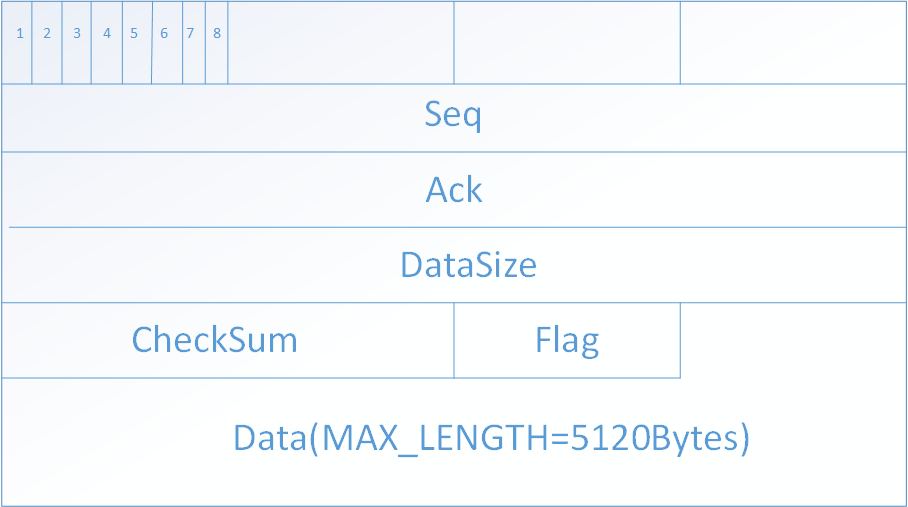
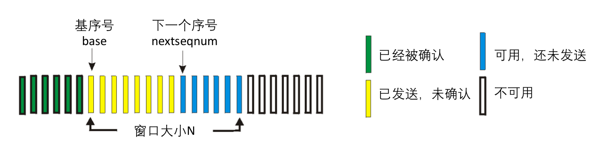
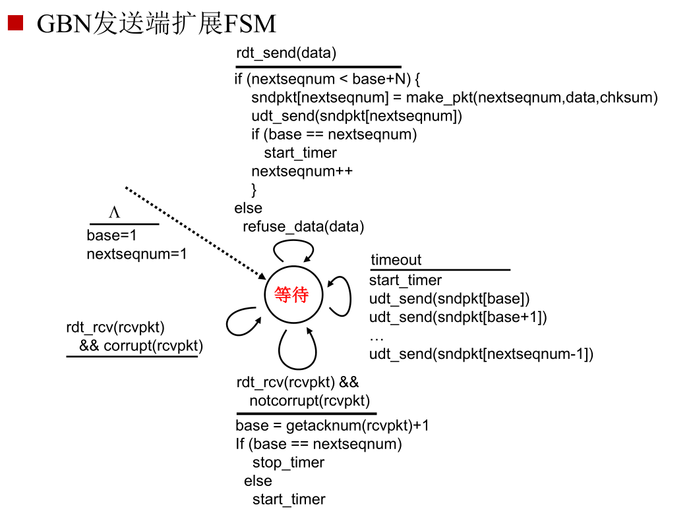
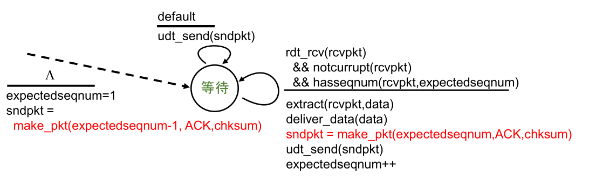
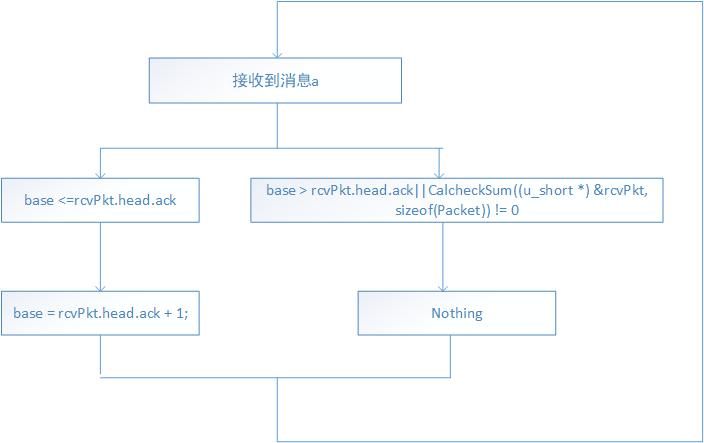
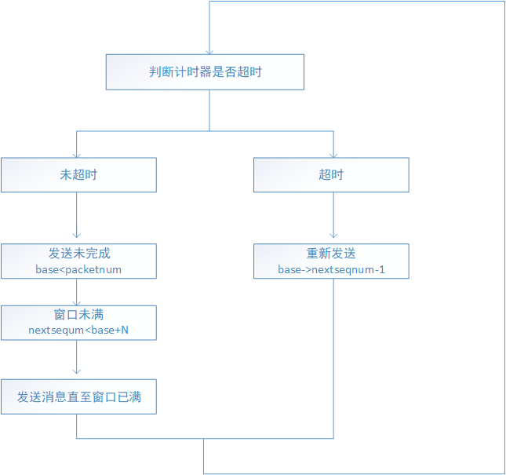
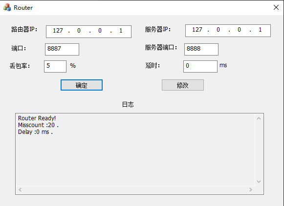
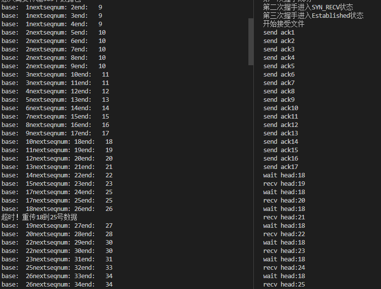
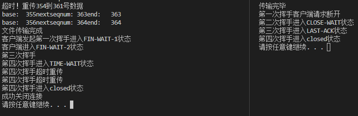
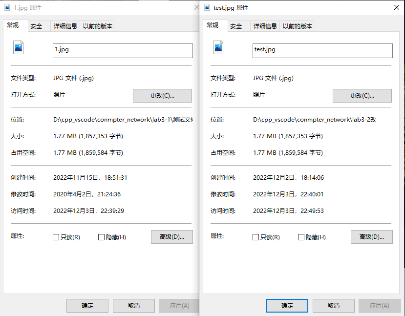

<center><h1>实验3-2：基于滑动窗口的流量控制机制</h1></center>

**2013605**

# 协议设计

> 本次实验采用 GBN 实现可靠数据传输

**报文结构:**



**定义：**

```c++
#define MAX_DATA_SIZE 10240
struct RDTHead
{
    unsigned int seq;//序列号，发送端
    unsigned int ack;//确认号码，发送端和接收端用来控制
    unsigned short checkSum;//校验和 16位
    unsigned int dataSize;      //标识发送的数据的长度,边界判断与校验和
    char flag;              //ACK，FIN，SYN，END
    
    RDTHead()
    {
        this->seq=this->ack=0; 
        this->checkSum=this->dataSize=this->flag=0;
    }
};

struct RDTPacket
{
    /* data */
    RDTHead head;
    char data[MAX_DATA_SIZE];
};
```


如图所示，数据报文由报文头和数据部分组成。其都为定长。

## 报文头

> Seq：表示发送的报文的序列号，接收端识别并确认。最大值为4294967295
>
> Ack：与SEQ对应。表示接收端对收到的报文的序列号的确认。
>
> CheckSum：校验和，可以确认报文在传输过程中是否受到损坏，用于差错检测。
>
> Flag：用于握手和挥手过程的标识。主要用到了低四位标识不同的包。
>
> DataSize：标识数据部分实际有效大小，用来确定传输文件的边界。
>
> > SYN 0x1：用于三次握手
> >
> > ACK 0x2：用于三次握手和四次挥手
> >
> > FIN 0x4：用于四次挥手
> >
> > END 0x8：用于标识单个文件传输完毕。

## 报文数据

**由于路由程序转包的最大包大小为 15000 字节，所以设计报文的数据部分大小不超过15000-`sizeof(header)`字节即可。**

# 流水线协议：Go-Back-N (GBN)

* 允许发送端发出N个未得到确认的分组

* 采用累积确认，只确认连续正确接收分组的最大序列号，可能接收到重复的ACK

* 发送端设置定时器，定时器超时时，重传所有未确认的分组

**为了实现基于滑动窗口的流量控制机制，发送端需要维护维护了一个缓冲区，如图所示为发送端的发射缓冲区：**



- **base：**窗口底部，代表**base-1**及以前部分消息已经全部传输完毕，且**收到了对方返回的对应ACK**，**msgsend[base]**是下面要**接收对应ACK**的消息
- **N：**窗口大小，本次实验取N=8
- **nextseqnum：**下一条要发送的消息

## 发送端



## 接收端

* 只使用ACK，确认按序正确接收的最高序号分组
  • 会产生重复的ACK，需要保存希望接收的分组序号 (expectedseqnum)
* 失序分组（未按序到达）处理
  • 不缓存、丢弃
  • 重发ACK，确认按序正确接收的最高序号分组



# 具体实现

## 发送端

**为了实现消息的同时收发，提高效率，使用多线程编程。**

> client的接收线程



```c++
DWORD WINAPI clientRecv(LPVOID lparam)
{
    
    Parameters *p = (Parameters *)lparam;
    int packetNum = int(p->fileLen / MAX_DATA_SIZE);
    int remain = p->fileLen % MAX_DATA_SIZE ? 1 : 0;
    packetNum += remain;
    char *dataBuffer = new char[MAX_DATA_SIZE], *pktBuffer = new char[sizeof(Packet)];
    Packet rcvPkt;
    int addrLen = sizeof(p->serverAddr);
    while (true)
    {
        if (recvfrom(p->clientSocket, pktBuffer, sizeof(Packet), 0, (SOCKADDR *)&p->serverAddr, &addrLen) > 0)
        {
            memcpy(&rcvPkt, pktBuffer, sizeof(Packet));

            if (base > rcvPkt.head.ack||CalcheckSum((u_short *) &rcvPkt, sizeof(Packet)) != 0) //忽略相同的ACK
            {
                //cout << "收到错误的ACK:    " << rcvPkt.head.ack << "期望收到的ACK:    " << base << endl;
            }
            else
            {
                start = clock();
                //cout << "收到确认 " << rcvPkt.head.ack << endl;
                base = rcvPkt.head.ack + 1;
            }
           

            if (base == nextseqnum&&base==packetNum+1)
            {
                Head endPacket;
                setEND(endPacket.flag);
                endPacket.checkSum = CalcheckSum((u_short *)&endPacket, sizeof(endPacket));
                memcpy(pktBuffer, &endPacket, sizeof(endPacket));
                sendto(p->clientSocket, pktBuffer, sizeof(endPacket), 0, (SOCKADDR *)&p->serverAddr, addrLen);

                u_long imode = 1;
                ioctlsocket(p->clientSocket, FIONBIO, &imode); //先进入非阻塞模式
                start = clock();
                while (recvfrom(p->clientSocket, pktBuffer, sizeof(endPacket), 0, (SOCKADDR *)&p->serverAddr, &addrLen) <= 0)
                {
                    if (clock() - start >= MAX_TIMEOUT)
                    {
                        memcpy(pktBuffer, &endPacket, sizeof(endPacket));
                        sendto(p->clientSocket, pktBuffer, sizeof(endPacket), 0, (SOCKADDR *)&p->serverAddr, addrLen);
                        start = clock();
                    }
                }
                if (((Head *)(pktBuffer))->flag & ACK &&
                    CalcheckSum((u_short *)pktBuffer, sizeof(Head)) == 0)
                {
                    cout << "文件传输完成" << endl;
                    isStop = true;
                    return 0;
                }
            }
        }
    }
}
```


> client的发送线程



```c++
DWORD WINAPI clientSend(LPVOID lparam)
{
    Parameters *p = (Parameters *)lparam;
    int packetNum = int(p->fileLen / MAX_DATA_SIZE);
    int remain = p->fileLen % MAX_DATA_SIZE ? 1 : 0;
    packetNum += remain;
    cout << "总共需要传输" << packetNum << "个数据包" << endl;
    int dataSize;
    int addrLen = sizeof(p->serverAddr);
    char *dataBuffer = new char[MAX_DATA_SIZE], *pktBuffer = new char[sizeof(Packet)];

    start = clock();
    while (true)
    {
        if (isStop == true)
            return 0;
        if (clock() - start > MAX_TIMEOUT)
        {
            cout << "超时！重传" << base << "到" << nextseqnum - 1 <<"号数据"<< endl;
            int count = nextseqnum - base;
            int tmp = base;
            for (int i = 0; i < count; i++)
            {
                dataSize = MAX_DATA_SIZE;
                if ((tmp)*MAX_DATA_SIZE > p->fileLen) //
                {
                    dataSize = p->fileLen - (tmp - 1) * MAX_DATA_SIZE;
                }
                memcpy(dataBuffer, p->fileBuffer + (tmp - 1) * MAX_DATA_SIZE, dataSize);
                Packet sendPkt = mkPacket(tmp, dataBuffer, dataSize);
                memcpy(pktBuffer, &sendPkt, sizeof(Packet));
                sendto(p->clientSocket, pktBuffer, sizeof(Packet), 0, (SOCKADDR *)&p->serverAddr, addrLen);
                //cout << tmp << "号数据包已经重新发送" << endl;
                tmp++;
            }
            start = clock();
        }
        else
        {
            while (nextseqnum <= packetNum)
            {
                if (nextseqnum < base + windowSize)
                {
                    dataSize = MAX_DATA_SIZE;
                    if ((nextseqnum)*MAX_DATA_SIZE > p->fileLen) //
                    {
                        dataSize = p->fileLen - (nextseqnum - 1) * MAX_DATA_SIZE;
                    }
                    memcpy(dataBuffer, p->fileBuffer + (nextseqnum - 1) * MAX_DATA_SIZE, dataSize);
                    Packet sendPkt = mkPacket(nextseqnum, dataBuffer, dataSize);
                    memcpy(pktBuffer, &sendPkt, sizeof(Packet));
                    sendto(p->clientSocket, pktBuffer, sizeof(Packet), 0, (SOCKADDR *)&p->serverAddr, addrLen);
                    if (base == nextseqnum) {
                        start = clock();
                    }
                    nextseqnum++;
                    cout << "base:  " << base << "nextseqnum: " << nextseqnum << "end:   " << base + windowSize << endl;
                    //start = clock();
                }
                else
                    break;
            }
        }
    }
}
```


## 接收端

- 按顺序接收对方发来的消息**seqnum（收到的消息序号）==expectedSeq**，且校验和正确，**返回对应的ACK（ackseq=expectedSeq）**
- 如果发生消息**失序**，即**expectedSeq!=recvseqnum**，或**校验和错误**，则丢弃消息，**返回ACK=recvseqnum-1ACK**

```c++
bool recv(char *fileBuffer, SOCKET &socket, SOCKADDR_IN &addr, unsigned long &filelen) {
    filelen = 0;
    int addrLen = sizeof(addr);
    u_int expectedSeq = 1;
    int dataLen;

    char *pktBuffer = new char[sizeof(Packet)];
    Packet recvPkt, sendPkt= mkPacket(-1);

    while (true) {
        memset(pktBuffer, 0, sizeof(Packet));
        recvfrom(socket, pktBuffer, sizeof(Packet), 0, (SOCKADDR *) &addr, &addrLen);
        memcpy(&recvPkt,pktBuffer, sizeof(Packet));
        if(recvPkt.head.seq==expectedSeq && CalcheckSum((u_short*)&recvPkt, sizeof(Packet))==0){
            //收到正确的ack；
            sendPkt = mkPacket(expectedSeq);
            memcpy(pktBuffer, &sendPkt, sizeof(Packet));
            sendto(socket, pktBuffer, sizeof(Packet), 0, (SOCKADDR *) &addr, addrLen);
    
            dataLen = recvPkt.head.dataSize;
            memcpy(fileBuffer + filelen, recvPkt.data, dataLen);
            filelen += dataLen;
            cout<<"send ack"<<expectedSeq<<endl;
            expectedSeq++;
           
            continue;
        }
        if (isEND(recvPkt.head.flag) && CalcheckSum((u_short*)&recvPkt, sizeof(Head))==0) {
            cout << "传输完毕" << endl;
            Head endPacket;
            setACK(endPacket.flag);
            endPacket.checkSum = CalcheckSum((u_short *) &endPacket, sizeof(Head));
            memcpy(pktBuffer, &endPacket, sizeof(Head));
            sendto(socket, pktBuffer, sizeof(Head), 0, (SOCKADDR *) &addr, addrLen);
            return true;
        }

        
        cout<<"wait head:"<<expectedSeq<<endl;
        cout<<"recv head:"<<recvPkt.head.seq<<endl;
        memcpy(pktBuffer, &sendPkt, sizeof(Packet));
        sendto(socket, pktBuffer, sizeof(Packet), 0, (SOCKADDR *) &addr, addrLen);
    }
}
```

# 实验展示

路由器Router设置：



**三次握手建立连接**


**文件传输与重传演示**



**传输完成于四次挥手断开连接**



## 结果对比


