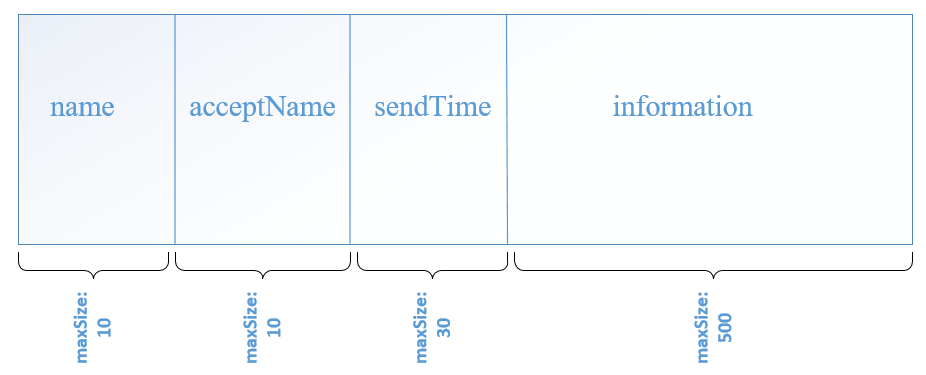
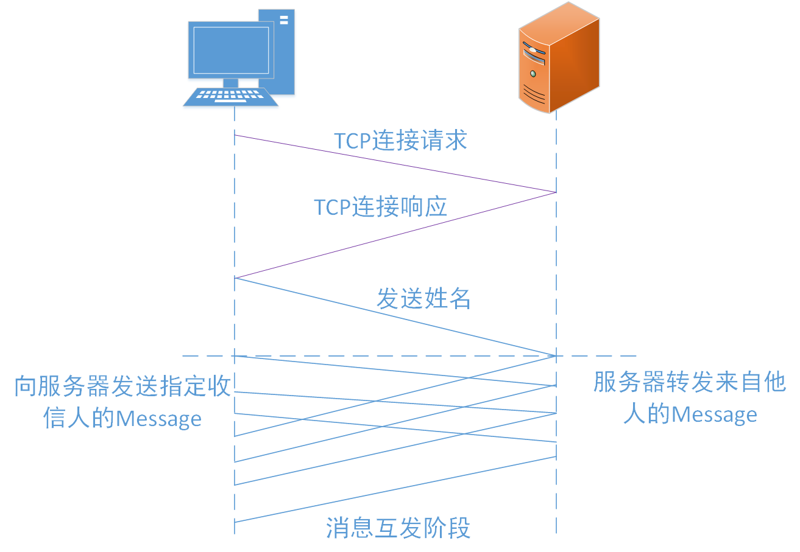

<center><h1>实验一报告 </h1></center>

# 协议设计

其消息类型为**Message**，主要有四部分组成：发送人的姓名；接收人的姓名，发送时间；信息内容。

## 语法



* 如上图所示，消息主要由四部分构成：**发送人的姓名(name)**；**接收人的姓名(acceptName)**，**发送时间(sendTime)**；**消息内容(information)**。
* 数据长度都是可变的，但规定了最大字符数。其中姓名最多占用10个Byte，发送时间最多占用30个Byte，信息内容最多占用500个Byte。
* 由于数据长度可变，所以采用**特殊分隔符法**分割数据，方便消息在服务器和用户端的解析。

## 语义

* 发送人的姓名用于告诉接收人消息的来源
* 接收人的姓名是一种控制信息，用来告诉服务器消息转发的对象。当接受人指定为一个人姓名时，消息会被精准转发出去，**特别的，当接收人被指定为`ALL`时该消息会被转发给所有人**。
* 发送时间用于时间标签和日志的记录等。
* 消息内容是用户想要真正传递给别人的信息。
* 管道符“|”用于表示消息各组成部分界限

## 时序

1. 用户连接到服务器后向服务器发送其用户名。
2. 服务器将上线用户的用户名与其 SOCKET 绑定，完成用户的注册。

# 传输流程及各模块功能

## 连接建立、多线程通信及录用户管理

### 服务器端

**当服务器与一个客户端建立连接，都新建一个线程进行信息的传递**

```c++
SOCKET serverSocket = socket(AF_INET, SOCK_STREAM, IPPROTO_TCP);//创建welcome socket
SOCKADDR_IN serverAddr;
serverAddr.sin_family = AF_INET;      //IP格式
USHORT uPort = 8888;				  //固定端口号
serverAddr.sin_port = htons(uPort);   //绑定端口号
serverAddr.sin_addr.S_un.S_addr = inet_addr("127.0.0.1");//固定IP地址
bind(serverSocket, (SOCKADDR*)&serverAddr, sizeof(serverAddr))//将socket与IP与端口绑定
    
listen(serverSocket, maxClient);//开始监听，等待客户端连接
accept(serverSocket, (SOCKADDR*)&clientAddr,sizeof(SOCKARR_IN));//接受连接，返回用于通信的socket
//线程的建立，服务器与每一个客户端都建立一个线程
hThread = CreateThread(NULL, NULL, clien_run, (LPVOID)&clients[num], 0, NULL);
```

**服务器端在于客户端建立连接后，需要维护一个用户数据结构，方便管理和数据的转发**

* 根据建立连接的时间顺序，确定用户id号，同时也是用户数据结构在数组的索引
* 将用户的姓名与id号建立一个map映射，方便服务器快速查找用户，不必遍历用户数组查找

```c++
class myClient
{
    public:
    int id;//用户id号
    int valid;//用户是否在线的标志位
    char *name;//用户姓名
    SOCKET scoket;//连接建立后返回的通信socket
    myClient();
};
myClient clients[maxClient];//将用户数据结构存储在数组中
map<string,int> name_id;//姓名与id(数组索引)映射
```

### 客户端

```c++
SOCKET clientSocket = socket(AF_INET, SOCK_STREAM, IPPROTO_TCP);//客户端client的建立
//指定服务器的地址
SOCKADDR_IN serverAddr;
serverAddr.sin_family = AF_INET;      //IP格式
USHORT uPort = 8888;
serverAddr.sin_port = htons(uPort);   //绑定端口号
serverAddr.sin_addr.S_un.S_addr = inet_addr("127.0.0.1");
//与服务器建立连接
connect(clientSocket, (SOCKADDR *) &serverAddr, sizeof(SOCKADDR))
    
//当与服务器建立连接时，新建两个线程用于消息的发送与接收   
HANDLE hthread[2];
hthread[0] = CreateThread(NULL, 0, clientRecv, (LPVOID) &clientSocket, 0, NULL);
hthread[1] = CreateThread(NULL, 0, clientSend, (LPVOID) &clientSocket, 0, NULL);
```

## 传输流程



* **当客户端与服务器建立连接后，客户端会创建两个线程，一个用于发送消息，另外一个接收消息。在发送消息的线程中，会先要求用户发送自己的姓名给服务器。之后用户可以随意地发送消息。**
* **每当与一个客户端相连，服务器就会创建一个线程，用于接受与转发来自此客户端的消息。服务器会把来自客户端的第一条消息解析成用户姓名存储在“用户”数据结构中。当再接收到后来的消息时，会根据Message的格式解析出接收者的姓名，根据map映射寻找到对应的socket，然后进行转发。**
* **客户端接收到来自服务器的Message后，会根据Message的格式解析出发送者姓名，然后打印出来。**

## 客户端发送消息的实现

```c++
DWORD WINAPI clientSend(LPVOID lparam) {	//客户端用于发送消息的线程
    SOCKET *socket = (SOCKET *) lparam;
    char *name = new char[nameSize];
    memset(name, 0, nameSize);
    cin>>name;	//发送者的姓名
    int len = send(*socket, name, strlen(name), 0);	//向服务器发送自己的姓名即告知身份。
    char sendData[1024];	//用于存储报文
    //下面三个字符数组分别存储接收者姓名，发送时间，消息内容
    char acceptName[nameSize];	char sendTime[30];	char info[500];
    while (true) { 
        //获取当前时间
        time_t timep;
        time (&timep);
        strftime(sendTime, sizeof(sendTime), "%Y-%m-%d %H:%M:%S",localtime(&timep) );
        cin>>acceptName;
        if(strcmp("quit",acceptName)==0){	//判断用户是否退出
 			strcpy(sendData,name);strcat(sendData,"|");strcat(sendData,"ALL");
            strcat(sendData,"|");strcat(sendData,sendTime);strcat(sendData,"|");
            strcat(sendData,"quit");	//报文的组合，以管道符“|”为分隔符
            cout<<sendTime<<"   您已成功退出聊天"<<endl;
            int len = send(*socket,sendData,strlen(sendData),0);
            return 0;
        }
        //如果用户不是退出，则用户可输入具体消息内容
        cin.getline(info,500);  
        //同上组合报文并发送。省略......
        memset(sendData, 0, 1024);
    }
}
```

## 服务器端接受消息的实现

```c++
DWORD WINAPI clien_run(LPVOID lparam) {
    myClient * client = (myClient*) lparam;
    //接收客户端的name并将与id的映射存储在map数据结构中
    char name[nameSize];
    memset(name,0,nameSize);
    int len = recv(client->scoket, name, nameSize-1, 0); //接收用户名
    if(len==0){
         cout<<"连接已经关闭"<<endl;
    }
    //完善用户数据结构与map的映射
    name[len] = '\0';	client->name = name; name_id[name]=client->id;
    cout<<onlineTime<<"    "<<client->name<<"上线"<<endl;	//日志打印
    char recvData[1024];	char sendData[1024];	//接收消息与转发的临时存储空间
    while(true)
    {
        int len = recv(client->scoket, recvData, 1023, 0);	//接收消息（会阻塞）
        recvData[len]='\0';
        if(len>0){
            proStr(recvData);//对接受的消息根据报文格式解析，然后实现转发、群发等功能；
        }
        memset(recvData,0,1024);
    }
}
```

## 服务器转发消息的实现

```c++
void proStr(char *recvData)
{
    string sendName,acceptName,sendTime,info;
    string str = recvData;
    string pattern = "|";               //字符串间隔用"|"表示
    string strs = str + pattern;
    size_t pos = strs.find(pattern);
    int i=0;
    while(pos != strs.npos){
        string temp = strs.substr(0, pos); 
        //去掉已分割的字符串,在剩下的字符串中进行分割
        strs = strs.substr(pos+1, strs.size());
        pos = strs.find(pattern);
        switch (i)
        {
        case 0:
            sendName = temp;
            break;
        case 1:
            acceptName = temp;
            break;
        case 2:
            sendTime = temp;
        case 3:
            info   = temp;
        default:
            break;
        }
        i++;
    }
    cout<<sendName<<" 在 "<<sendTime<<" 向 "<<acceptName<<" 发送了一条消息"<<endl;
    if(info=="quit"){
        cout<<sendTime<<"   "<<sendName<<"退出聊天"<<endl;
        clients[name_id[sendName]].valid=0;
    }
    if(acceptName=="ALL"){
        //实现群发功能
        for (auto iter = name_id.begin(); iter != name_id.end(); ++iter) {//群发
			if (iter->second == name_id[sendName]||
                clients[iter->second].valid==0)continue;
			send(clients[iter->second].scoket, recvData, strlen(recvData), 0);
		}
    }
    else{
        map<string,int>::iterator iter = name_id.find(acceptName);
        //群发与转发消息，等待实现
        if(iter != name_id.end()&&clients[iter->second].valid==1) 
            send(clients[iter->second].scoket,recvData,strlen(recvData),0);
        else    //当找不到用户时，返回报错信息，等待实现
        cout<<sendTime<<"   "<<"找不到用户"<<endl;
        //当用户valid为零时，等待实现
    }
}
```


